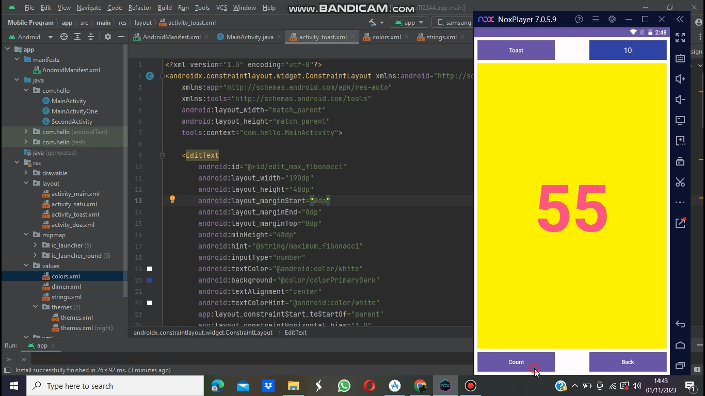

# HelloAppTI22A4

```
Nama        : Liskania Aprilia
Kelas       : TI.22.A4
NIM         : 312210383
Mata Kuliah : Pemrograman Mobile (UTS)
```

# Android Manifest

Android manifest adalah file XML yang berisi informasi dasar tentang aplikasi Android, seperti nama aplikasi, versi, izin yang dibutuhkan, layanan yang disediakan, dan aktivitas yang dapat dijalankan oleh aplikasi.

```XML
<?xml version="1.0" encoding="utf-8"?>
<manifest xmlns:android="http://schemas.android.com/apk/res/android"
    xmlns:tools="http://schemas.android.com/tools">

    <application
        android:allowBackup="true"
        android:dataExtractionRules="@xml/data_extraction_rules"
        android:fullBackupContent="@xml/backup_rules"
        android:icon="@mipmap/ic_launcher"
        android:label="@string/app_name"
        android:roundIcon="@mipmap/ic_launcher_round"
        android:supportsRtl="true"
        android:theme="@style/Theme.HelloAppTI22A4"
        tools:targetApi="31">

        <activity
            android:name=".MainActivity"
            android:exported="true">
            <intent-filter>
                <action android:name="android.intent.action.MAIN" />

                <category android:name="android.intent.category.LAUNCHER" />
            </intent-filter>
        </activity>
    </application>

</manifest>
```

# String

String pada Android Studio adalah tipe data yang digunakan untuk menyimpan teks. String dapat digunakan untuk menyimpan teks apa pun, seperti nama, alamat, atau deskripsi. String direpresentasikan sebagai urutan karakter, dan dapat diakses menggunakan indeks.

```XML
<resources>
    <string name="app_name">HelloAppTI22A4</string>
    <string name="button_label_toast">Toast</string>
    <string name="button_label_count">Count</string>
    <string name="count_initial_value">0</string>
    <string name="toast_message">Bilangan Fibonacci</string>
    <string name="button_label_finish">Back</string>
    <string name="enter_fibonacci_limit">Masukan limit angka</string>
    <string name="maximum_fibonacci">Enter Limit</string>
</resources>
```

# Colors

Colors pada Android Studio adalah kumpulan warna yang dapat digunakan di aplikasi Android. Colors direpresentasikan sebagai objek Color, yang dapat digunakan untuk menentukan warna teks, latar belakang, atau objek lainnya.

```XML
<?xml version="1.0" encoding="utf-8"?>
<resources>
    <color name="white">#FFFFFFFF</color>
    <color name="biru">#0000FF</color>
    <color name="colorPrimary">#3F51B5</color>
    <color name="colorAccent">#FF4081</color>
    <color name="purple">#3F51B5</color>
    <color name="yellow">#FFFF00</color>
</resources>
```

# Main Activity

Main activity adalah aktivitas yang pertama kali dijalankan saat aplikasi Android dimulai. Aktivitas ini biasanya digunakan untuk menampilkan antarmuka awal aplikasi, seperti layar login atau layar beranda. Main activity didefinisikan dalam file AndroidManifest.xml dengan elemen activity. Elemen ini memiliki atribut android:name yang berisi nama aktivitas.

```JAVA
package com.hello;

import androidx.appcompat.app.AppCompatActivity;

import android.os.Bundle;
import android.view.View;
import android.widget.EditText;
import android.widget.TextView;
import android.widget.Toast;

public class MainActivity extends AppCompatActivity {

    private TextView showCount;
    private int count = 1;
    private long fibNMinus1 = 1;
    private long fibNMinus2 = 0;
    private EditText edit_max_fibonacci;

    @Override
    protected void onCreate(Bundle savedInstanceState) {
        super.onCreate(savedInstanceState);
        setContentView(R.layout.activity_toast);

        showCount = findViewById(R.id.show_count);
        edit_max_fibonacci = findViewById(R.id.edit_max_fibonacci);

        Object updateCountDisplay;

        fibNMinus1 = 1;
        fibNMinus2 = 0;
    }

    private void updateCoutDisplay() {
        showCount.setText(String.valueOf(fibNMinus1));

        if(count % 4 == 0) {
            showCount.setTextColor(getResources().getColor(R.color.colorPrimary));
        } else if (count % 4 == 1) {
            showCount.setTextColor(getResources().getColor(R.color.colorAccent));
        } else if (count % 4 == 2) {
            showCount.setTextColor(getResources().getColor(R.color.colorPrimary));
        } else {
            showCount.setTextColor(getResources().getColor(R.color.colorAccent));
        }
    }
    public void showToast(View view) {
        Toast.makeText(this, "Bilangan Fibonacci",
                Toast.LENGTH_SHORT).show();
    }
    public void countUp(View view) {
       int maxFibonacci = Integer.parseInt(edit_max_fibonacci.getText().toString());

       if (count >= maxFibonacci) {
           Toast.makeText(this, "Maximum Fibonacci tercapai", Toast.LENGTH_SHORT).show();
           return;
       }

       long fibCurrent;
       if (count == 0 || count == 1) {
           fibCurrent = 1;
       } else {
           fibCurrent = fibNMinus1 + fibNMinus2;
       }

       fibNMinus2 = fibNMinus1;
       fibNMinus1 = fibCurrent;
       updateCoutDisplay();
       count++;
    }

    public void back1(View view) {
        count = 0;
        fibNMinus1 = 1;
        fibNMinus2 = 0;
        updateCoutDisplay();
    }
}
```

# Activity Toast

Activity pada Android Studio adalah komponen yang menyediakan antarmuka pengguna (UI) untuk aplikasi. Activity adalah satu layar di aplikasi Android, dan setiap activity memiliki layout sendiri. Activity dapat berisi berbagai elemen UI, seperti tombol, teks, gambar, dan video. Activity adalah komponen penting dari aplikasi Android. Activity digunakan untuk menampilkan informasi kepada pengguna dan menerima input dari pengguna. Activity juga dapat digunakan untuk memulai aktivitas lain, menjalankan layanan, dan melakukan tugas-tugas lainnya.

```XML
<?xml version="1.0" encoding="utf-8"?>
<androidx.constraintlayout.widget.ConstraintLayout xmlns:android="http://schemas.android.com/apk/res/android"
    xmlns:app="http://schemas.android.com/apk/res-auto"
    xmlns:tools="http://schemas.android.com/tools"
    android:layout_width="match_parent"
    android:layout_height="match_parent"
    tools:context="com.hello.MainActivity">
</androidx.constraintlayout.widget.ConstraintLayout>
```

## 1. Activity_Toast - Edit Text Limit Fibonacci
```XML
<EditText
        android:id="@+id/edit_max_fibonacci"
        android:layout_width="190dp"
        android:layout_height="48dp"
        android:layout_marginStart="8dp"
        android:layout_marginEnd="8dp"
        android:layout_marginTop="8dp"
        android:minHeight="48dp"
        android:hint="@string/maximum_fibonacci"
        android:inputType="number"
        android:textColor="@android:color/white"
        android:background="@color/colorPrimaryDark"
        android:textAlignment="center"
        android:textColorHint="@android:color/white"
        app:layout_constraintStart_toStartOf="parent"
        app:layout_constraintHorizontal_bias="1.0"
        app:layout_constraintEnd_toEndOf="parent"
        app:layout_constraintTop_toTopOf="parent"
        tools:ignore="MissingTranslation" />
```

## 2. Activity_Toast - Button Toast
```XML
<Button
        android:id="@+id/button_toast"
        android:layout_width="190dp"
        android:layout_height="wrap_content"
        android:layout_marginStart="8dp"
        android:layout_marginTop="8dp"
        android:layout_marginEnd="8dp"
        android:background="@color/colorPrimary"
        android:onClick="showToast"
        android:text="@string/button_label_toast"
        android:textColor="@android:color/white"
        app:layout_constraintEnd_toEndOf="parent"
        app:layout_constraintHorizontal_bias="0.0"
        app:layout_constraintStart_toStartOf="parent"
        app:layout_constraintTop_toTopOf="parent" />
```

## 3. Activity_Toast = Button Count
```XML
<Button
        android:id="@+id/button_count"
        android:layout_width="190dp"
        android:layout_height="48dp"
        android:layout_marginStart="8dp"
        android:layout_marginEnd="8dp"
        android:layout_marginBottom="8dp"
        android:background="@color/colorPrimary"
        android:onClick="countUp"
        android:text="@string/button_label_count"
        android:textColor="@android:color/white"
        app:layout_constraintBottom_toBottomOf="parent"
        app:layout_constraintEnd_toEndOf="parent"
        app:layout_constraintHorizontal_bias="0.0"
        app:layout_constraintStart_toStartOf="parent"
        tools:ignore="UsingOnClick, VisualLinButtonSize" />
```

## 4. Activity_Toast - Button Finish
```XML
<Button
        android:id="@+id/button_finish"
        android:layout_width="190dp"
        android:layout_height="48dp"
        android:layout_marginStart="8dp"
        android:layout_marginEnd="8dp"
        android:layout_marginBottom="8dp"
        android:background="@color/colorPrimary"
        android:onClick="back1"
        android:text="@string/button_label_finish"
        android:textColor="@android:color/white"
        app:layout_constraintBottom_toBottomOf="parent"
        app:layout_constraintEnd_toEndOf="parent"
        app:layout_constraintHorizontal_bias="1.0"
        app:layout_constraintStart_toStartOf="parent"
        tools:ignore="UsingOnClickInXml" />
```

## 5. Activity_Toast - Text View Show Count
```XML
<TextView
        android:id="@+id/show_count"
        android:layout_width="0dp"
        android:layout_height="0dp"
        android:layout_marginStart="8dp"
        android:layout_marginTop="8dp"
        android:layout_marginEnd="8dp"
        android:layout_marginBottom="8dp"
        android:background="#FFFF00"
        android:gravity="center_vertical"
        android:text="@string/count_initial_value"
        android:textAlignment="center"
        android:textColor="@color/colorPrimary"
        android:textSize="160sp"
        android:textStyle="bold"
        app:layout_constraintBottom_toTopOf="@+id/button_count"
        app:layout_constraintEnd_toEndOf="parent"
        app:layout_constraintStart_toStartOf="parent"
        app:layout_constraintTop_toBottomOf="@+id/button_toast"
        tools:ignore="RtlCompat"/>
```

# Output - Bilangan Fibonnaci 
1. Memiliki perbedaan warna pada angka
2. Terdapat menu reset, menu count up, menu toast, dan menu limit

- YOUTUBE : [LINK-OUTPUT-FIBONACCI](https://youtu.be/KYZNZRyQUqE?siR380up1LjObY540u)




# FINISH